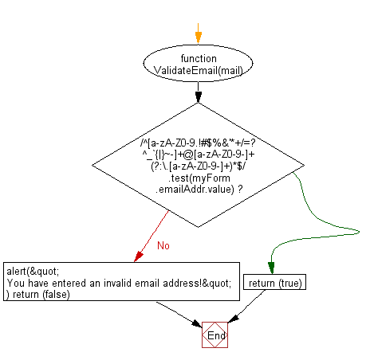

# Welcome to World of Regex

As a web development student or a person who is new to or inexperienced in a field or situation, we want a tutorial explaining a what regex is.
So that we 'novice' can understand the search pattern the regex defines.
So here I create a tutorial that explains how a specific regular expression (regex), functions by breaking down each part of the expression and describing what it does.

## Summary

### So what is Regex? 

A regex, short for regular expression, is a sequence of characters that defines a specific search pattern. When included in code or search algorithms, regular expressions can be used to find certain patterns of characters within a string, or to find and replace a character or sequence of characters within a string. They are also frequently used to validate input.

Let us use this regex code what validates whether it is a email address or not to nevigate us to the world of regex

`/^([a-z\d_\.-]+)@([a-z\d-]+)\.([a-z]{2,6})(\[a-z]{2,6})$/`

## Table of Contents

- [Anchors](#anchors)
- [Quantifiers](#quantifiers)
- [OR Operator](#or-operator)
- [Character Classes](#character-classes)
- [Flags](#flags)
- [Grouping and Capturing](#grouping-and-capturing)
- [Bracket Expressions](#bracket-expressions)
- [Greedy and Lazy Match](#greedy-and-lazy-match)
- [Boundaries](#boundaries)
- [Back-references](#back-references)
- [Look-ahead and Look-behind](#look-ahead-and-look-behind)

## Regex Components

### Anchors
Anchors belong to the family of regex tokens that don't match any characters, but that assert something about the string or the matching process. 

`/^([a-z\d_\.-]+)@([a-z\d-]+)\.([a-z]{2,6})(\.[a-z]{2,6})$/`

Anchors assert that the engine's current position in the string matches a well-determined location: for instance, the beginning of the string(caret or "circumflex" ^), or the end of a line (dollar sign $).

in addition The \(back-slash): quoting/escaping character. we typically used on escaping .(periods)

### Quantifiers
Quantifiers specify how many instances of a character, group, or character class must be present in the input for a match to be found.

`/^([a-z\d_\.-]+)@([a-z\d-]+)\.([a-z]{2,6})(\.[a-z]{2,6})$/`

in following code it will look through `[a-z\d_\.-]`. the last 2 digit in curly brackets `{2,6}` will match from two to six from `[a-z]` and `\.[a-z]`

The Plus `+` will match one or more of the Tokens

FYI: duplicated `\.[a-z]` is for where email have extra values at the end-point domains like co.kr or co.uk etc

### Character Classes

Regex class \d matches single character that represent a digit from 0-9. It will only match number that is a single digit.

### Grouping and Capturing

parenthese in Regex is what groups and captures codes.
Anything within a set is taken as a group, which allows each information inside to be treated as a single unit.

Let us look at the Example again

`/^([a-z\d_\.-]+)@([a-z\d-]+)\.([a-z]{2,6})(\.[a-z]{2,6})$/`

Between Caret and Dollar sign we can see group of set divided with ()

Lets think about this way (string)@(website).(com/edu/etc) template or (string)@(website).(co).(kr/uk/ca/jp)

Since 4th group is optional

### Bracket Expressions

Now we saw what () does, let's look at the Brackets.
A bracket expression represents a single charater. 
Let's look at the example part by part `[a-z\d_\.-]`, this will be match any lower case letter a-z and any digit, underscore or period or hyphen. Combined with the quantifier + which already introduced at the beginning; it will look through everything specifically matches.
Samething goes on following Regex Code.

### Greedy and Lazy Match

As I mentioned at the beginning with img shown above, quantifer can be used either greedy or lazy. A greedy quantifer will attempt to match as many characters as possible as it goes backwards through the regex string. A lazy quantifier will attempt to match as few characters as possible as it goes back through the regex string. By default, quantifiers are greedy unless affected by another quantifier.

Lets look at the chart again 

and lets compare it with our code

`/^([a-z\d_\.-]+)@([a-z\d-]+)\.([a-z]{2,6})(\.[a-z]{2,6})$/`

we only use greedy quantifier becuase we want to vaildate the email, so we have to match as many character as possible to reduce missing characters.

## Author

Richard YJ Kim, software engineer who constantly seeks out innovative solutions to everyday problems.

I welcome you to YJ World: https://github.com/richardyjkim